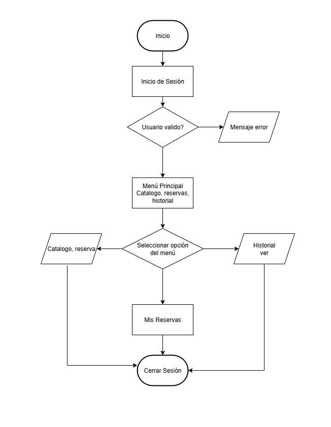

# Proyecto: Sistema de Reservas para Eventos Sociales

## INTRODUCCIÓN
La organización de eventos sociales, como bodas, cumpleaños o conferencias, suele ser un proceso complejo, pues implica la búsqueda y coordinación de múltiples servicios (locales, catering, decoración, música, etc.). Esto genera demoras, sobrecostos y desorden en la planificación.  

Frente a esta problemática, se desarrolló un **sistema de reservas para eventos sociales**, que centraliza todos los servicios en una sola plataforma digital, permitiendo a los usuarios realizar sus reservas de manera rápida, confiable y organizada.  

Con esta aplicación, se logró solucionar la falta de organización y centralización en el proceso de reservas, brindando a los usuarios una herramienta intuitiva que mejora la experiencia de planificación de eventos.

**¿Qué se desarrolló?**  
- Un sistema de reservas con interfaz gráfica (GUI) en Python.

**¿En dónde se desarrolló?**  
- En Python, utilizando librerías estándar como Tkinter.

**¿Qué logramos solucionar?**  
- La gestión manual de reservas, ofreciendo rapidez y accesibilidad.

---

## OBJETIVOS

### Objetivo General
Desarrollar una aplicación que permita a los usuarios gestionar de manera eficiente la reserva de servicios para eventos sociales, integrando funciones de registro, consulta, edición y confirmación de reservas.

### Objetivos Específicos
- Diseñar una interfaz gráfica amigable e intuitiva para facilitar la interacción del usuario.  
- Implementar un sistema centralizado de reservas que organice servicios en una base de datos.  
- Brindar al usuario un historial de reservas que permita llevar un control de sus eventos.  
- Aplicar metodologías de desarrollo de software para garantizar un producto funcional y confiable.

---

## DIAGRAMA DE FLUJO
## DIAGRAMA DE FLUJO

## GUÍA DE USO

1. **Iniciar Sesión / Registro**
   - El usuario abre la aplicación.  
   - Si ya tiene cuenta, ingresa su usuario y contraseña.  
   - Si no, se registra completando un formulario.

2. **Menú Principal**
   - Aparecen las opciones: `Catálogo`, `Mis Reservas`, `Historial`, `Salir`.

3. **Reservar un Servicio**
   - El usuario ingresa al catálogo y visualiza los servicios disponibles (ej. catering, local, decoración).  
   - Selecciona el servicio y hace clic en **Reservar**.  
   - Completa los campos: fecha, hora, tipo de evento.  
   - Confirma la reserva y se guarda en la base de datos.

4. **Mis Reservas**
   - El usuario visualiza las reservas activas.  
   - Puede editar o cancelar si lo desea.

5. **Historial**
   - Permite ver los eventos pasados y el detalle de las reservas.

---

## CONCLUSIONES
Este proyecto permitió reforzar mis conocimientos en desarrollo de software y resaltar la importancia de estructurar correctamente la información para que el sistema funcione de manera óptima. Además, se consolidaron habilidades en la creación de interfaces gráficas y gestión de bases de datos.

